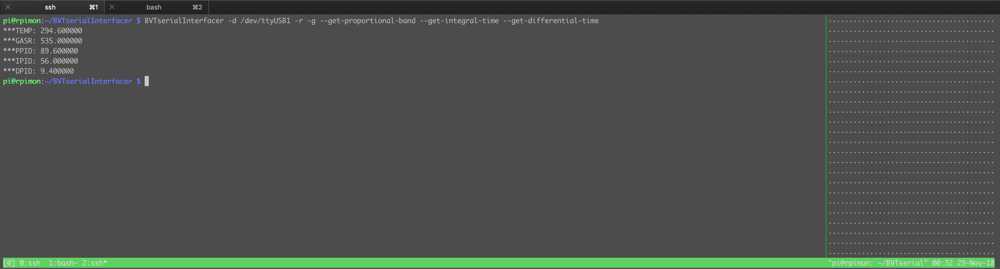

# BVT Serial Interfacer 

This program is a command line interface to the Bruker BVT3x00-series of variable temperature devices. 

They exist to alter the temperature of samples in spectrometers, from ~77K or below to as hot as you are willing to go. There are probably not many people on the planet who have these, or similar, devices, but if you are one of them, greetings! I hope you find this useful. 

While you can control what they do with the EDTE command in TopSpin, it requires a license of TopSpin and a Bruker spectrometer. You may wish to use them independently, or alternatively, to hook up the hardware to something more exotic. 

I found myself needing to do exactly this, and with few other available tools that are "lightweight" (and can run easily on a low-cost, low-spec computer such as a Raspberry Pi) decided to create one. This code borrows heavily from the excellent Fsc2 by Jens Thoms Toerring, http://users.physik.fu-berlin.de/~jtt/fsc2.phtml, which is a free (GPL'd) EPR spectrometer software.  


Installation
=======

This code relies upon libserialport, a cross-platform serial library that works on essentially all popular OSes. Either `apt-get install libserialport` it, or download and install the code in the usual way. 
After that, `make && sudo make install`. Note that if you are a (mad) developer and you want to see the hex that is sent and received from your device, `make debug`. This also requires GNU gengetopt as a dependency (or edit the Makefile). 

I'm hopefully going to write a WxPython / Chacao GUI wrapper around the whole lot. The hardware we have sits in a separate room, and is plugged into a USB serial interface on a raspberry pi. The pi does many things, and runs a (Pythonic) TCP/IP server that deals with custom commands. It will run a state machine to keep track of what the box is up to, and will speak to a gui running on the spectrometer computer. This CLI is just the glue in the works to enable the simple parsing of
what the box is up to. 


# Usage statement  
```
SerialInterfacer v1.0, Nov. 2018

This dodgy command line tool acts as a command line interfacer with the Bruker
BVT3000 NMR heater unit that uses a Eurotherm 902s PID controller.

It provides many silly, but hopefully useful, command line commands to check
hardware status, measure things, and so on. Everything is either dreadfully
verbose (with the -v switch), or alternatively consists of:
'***XXXX: VALUE', where 'XXXX' depends on the command requested (e.g. TEMP) and
'VALUE' is the return of that command. See the documentation (that I haven't
completely yet written...) for more details.


Usage: -d /path/to/serialPort command [command argument]

For variable temperature NMR experiments.

  -h, --help                    Print help and exit
  -V, --version                 Print version and exit

 Written by Jack J. Miller, University of Oxford, heavily ''inspired by'' code
from Fsc2, a free spectrometer driving software, written by Jens Thoms
Toerring.

Licensed under under the terms of the GNU General Public License, v3, or at
your choice any later license.

Given that this software can be used with hardware designed to cool samples to
77 K or heat them to 1000 K, please particularly note the section of the GPL
disclaiming liability!

  -v, --verbose                 Debugging verbosity  (default=off)

Serial devices:
  -d, --device=STRING           Serial port device to use
                                  (default=`/dev/null')
      --list-devices            List found serial devices for debugging
                                  purposes (specify a dummy -d=Path)
                                  (default=off)

Heater controls:
      --heater-on               Turn on the heater (Be careful!)  (default=off)
  -O, --heater-off              Turn the heater off  (default=off)


  -G, --get-heater-state        See if the heater is on or off  (default=off)
      --set-heater-power-limit=FLOAT
                                Live dangerously by increasing the maximum
                                  heater power (a percentage between 0/100)
      --get-heater-power-limit  Get the heater power limit  (default=off)
      --get-heater-power        Get the current heater power (as a percentage)
                                  (default=off)
      --set-heater-power=FLOAT  Set the current heater power (as a percentage)
  -X, --check-heater            Check to see if the heater is overheating
                                  (default=off)

Gas flow controls:
  -g, --get-gas-flow-rate       Return the gas flow rate in l/hr  (default=off)
  -s, --set-gas-flow-rate=FLOAT Set the gas flow rate to one of 16 values
                                  between 0 and 2000 l/hr. NB: 0 disables the
                                  heater.

Temperature methods:
  -r, --read-temperature        Read temperature  (default=off)
      --set-temperature-setpoint=FLOAT
                                Set the temperature setpoint
  -R, --get-temperature-setpoint
                                Get the current temperature setpoint
                                  (default=off)

Liquid Nitrogen methods (NB: you need the optional N2 evaporator):
      --get-ln2-heater-state    Get the LN2 heater state (on/off)
                                  (default=off)
      --set-ln2-heater-state=INT
                                Turn on/off the LN2 heater (1=on)
      --get-ln2-heater-power    Get the LN2 heater power  (default=off)
      --set-ln2-heater-power=FLOAT
                                Set the LN2 heater power (as a percentage)
      --check-ln2-heater        Check the LN2 tank to see if it is okay, needs
                                  a refil, or is empty  (default=off)

PID control:
  -E, --enable-PID-control      Enable the PID control of temperature to the
                                  setpoint  (default=off)
  -M, --manual-mode             Set the device into manual heater power mode
                                  (default=off)
      --get-mode                Return the current PID / Manual control mode
                                  (default=off)
      --set-proportional-band=FLOAT
                                Set the P part of PID
      --get-proportional-band   Get the P part of PID  (default=off)
      --set-integral-time=FLOAT Set the I part of PID
      --get-integral-time       Get the I part of PID  (default=off)
      --set-differential-time=FLOAT
                                Set the D part of PID
      --get-differential-time   Get the D in the PID  (default=off)

Misc. methods:
      --lock-keypad=INT         Unlock (1) or lock (0) the Eurotherm keypad
      --get-eurotherm-status    Get the status of the Eurotherm controller
                                  (alarming or not)  (default=off)
      --status-all              Return the status of everything that is a
                                  status  (default=off)
      --check-sensor-break      Check to see if the Thermocouples are broken
                                  (default=off)

 Example invocation to read temperature (K), and gas flow rate (l/hours):

 BVTserialInterfacer -d /dev/ttyUSB0 -r --get-gas-flow-rate
```

# Possible returned measured things, and example usage 

Pass a device, and a command. Note that all temperatures are always in Kelvin. 

| Response | Description| Flag |
| --------| ----------| - | 
|`***TEMP: %f` | Current measured temperature| `-r` | 
| `***SBC : OK` | Temperature measurement sensor is connected | `--check-sensor-break` | 
| `***HCC : OK` | Security thermocouple to the heater is OK | `--check-heater` |
| `***HPWL: %lf` | Heater power limit (in percent, 0 -> 100) | `--get-heater-power-limit` | 
| `***HPWR: %lf` | Current heater power (in percent, 0 -> 100) | `--get-heater-power` | 
| `***GASR: %lf` | Gas flow rate (l/hr) | `-g` 
| `***PIDM: AUTO` | Current PID mode (AUTO or MANUAL) | `--get-mode` | 
| `***TSP : %lf` | Current temperature setpoint (Kelvin) | `-R` | 
| `***PPID: %lf` | Current P part of PID | `--get-proportional-band` | 
| `***IPID: %lf` | Current I part of PID | `--get-integral-time` | 
| `***DPID: %lf` | Current D part of PID| `--get-differential-time` | 

# More Information 
Info about the BVT3000 and the Eurotherm 902s can be found on my personal website at http://www.jjmiller.info/post/NMR_Temperature_Fun/. 

Note that the Eurotherm and the BVTs implement a version of the Bisynch protocol over RS232 with 7 data bits, 1 (even) parity bit, 1 stop bit, at a maximum speed of 9600 baud. 

Example use "in the field"
-----------------

The below were obtained using a BVT3000 without any of the options and the heater off: 

 

```
pi@rpimon:~ $ BVTserialInterfacer -d /dev/ttyUSB1 -r -g --get-proportional-band --get-integral-time --get-differential-time
***TEMP: 294.600000
***GASR: 535.000000
***PPID: 89.600000
***IPID: 56.000000
***DPID: 9.400000
```

TODO 
=====
More testing needs to done to completely sort this out -- this does work, but look after the devices carefully. 
Also, \#ShouldHaveWrittenItInPerl! 

